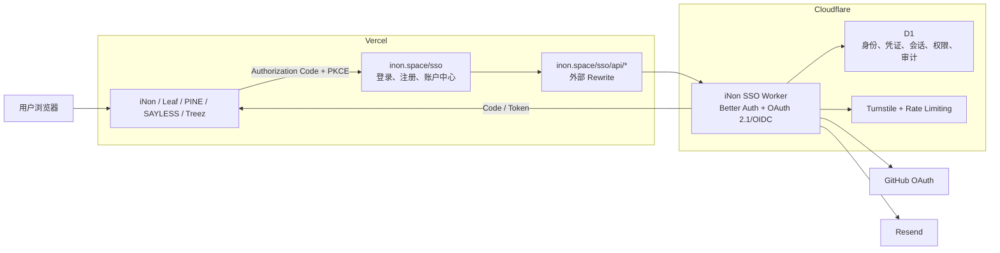

# iNon SSO 统一身份体系设计

- 状态：已确认，待实施
- 日期：2026-07-26
- 品牌：iNon
- 公开身份域名：`https://inon.space`
- 接入项目：iNon、Leaf、PINE、SAYLESS、Treez
- 中央代码位置：`iNon/sso/`

## 1. 背景

iNon、Leaf、PINE、SAYLESS 和 Treez 当前存在多套彼此独立的登录与权限实现：

- iNon、Leaf、PINE 使用不同方式集成 Supabase Auth。
- SAYLESS 使用 Cloudflare D1 上的自建鉴权。
- Treez 尚未形成完整登录体系。

旧体系的用户量较少，且大部分账号属于开发者本人，因此不迁移旧密码和旧会话。新体系上线后，旧用户统一通过邮箱验证码重新确认身份。

目标是在 `inon.space` 建设真正的中央 SSO，使任一 iNon 用户能够使用同一账号进入五个项目，不再重复注册。

## 2. 目标与非目标

### 2.1 目标

1. 建设唯一的 iNon 用户数据库。
2. 用户、凭证、会话、OAuth 授权、项目身份和审计数据全部托管在 Cloudflare。
3. 登录、注册、账户管理页面统一由 `https://inon.space/sso` 提供。
4. iNon 主站和五个项目继续部署在 Vercel。
5. 支持以下认证方式：
   - 邮箱验证码注册。
   - 邮箱验证码登录。
   - 邮箱密码登录。
   - 用户名密码登录。
   - GitHub 登录。
6. 邮箱验证成功后不强制设置用户名和密码，但用户可以稍后设置。
7. 实现普通用户、项目管理员和全局超级管理员的权限分层。
8. 用户首次进入某项目时自动成为该项目的普通成员。
9. 提供统一的 Next.js 接入 SDK 和共享界面组件。
10. 完成五个项目迁移，Treez 作为第一个参考接入。

### 2.2 非目标

1. 不接入 iNon、Leaf、PINE、SAYLESS、Treez 之外的网站。
2. 不保留旧密码、旧 Session 或旧 Refresh Token。
3. 不支持用户名加密码直接注册。
4. 不支持一个账号绑定多个邮箱。
5. 不支持用户自行删除账号。
6. 不建设第三方应用开放平台。
7. 第一阶段不支持 MFA。
8. 第一阶段不展示 OAuth 授权确认页。

## 3. 已确认的产品规则

### 3.1 注册

唯一注册方式为邮箱验证码：

1. 用户提交邮箱。
2. 系统发送一次性验证码。
3. 用户验证验证码。
4. 系统创建用户和中央会话。

注册完成时用户名和密码均可为空。

### 3.2 登录

系统提供四种登录方式：

1. 邮箱验证码。
2. 邮箱加密码。
3. 用户名加密码。
4. GitHub。

不存在独立的“用户名密码注册”入口。用户必须先验证邮箱或通过满足绑定条件的 GitHub 身份进入系统，再从账户中心设置用户名和密码。

### 3.3 邮箱

- 每个账号只能绑定一个邮箱。
- 邮箱全局唯一。
- 邮箱比较使用去除首尾空格后的 Unicode/ASCII 小写规范化值。
- 修改邮箱不属于第一阶段用户自助能力。

### 3.4 用户名

- 用户名全局唯一。
- 允许中文、英文字母、数字、下划线和短横线。
- 产品层面只有一个用户名，不区分用户名和显示名称。
- 数据库允许维护不可见的规范化键，用于唯一性和大小写不敏感比较。
- 规范化过程使用 Unicode NFKC，并将英文字母转为小写。
- 用户名每个滚动 30 天最多修改一次。

### 3.5 密码

- 密码只能由已完成身份验证的用户在账户中心设置。
- 设置密码后，同时支持邮箱密码和用户名密码登录。
- 密码哈希由 Better Auth 的安全密码实现负责，数据库不保存明文密码。
- 密码重置通过邮箱验证码完成。
- 修改或重置密码时可以撤销其他设备会话。

### 3.6 GitHub 登录与绑定

GitHub 登录由中央 SSO 作为唯一回调方处理。

绑定规则：

1. 已登录用户主动绑定 GitHub 时，将 GitHub 身份绑定到当前账号。
2. 未登录用户使用 GitHub 登录时：
   - 如果 GitHub 返回经过验证的主邮箱，且该邮箱与一个现有 iNon 用户匹配，则绑定到该用户。
   - 如果该邮箱不存在，则创建新的 iNon 用户，邮箱视为已验证。
   - 如果 GitHub 没有返回可用的已验证邮箱，则要求用户补充邮箱并完成 iNon 邮箱验证码验证。
3. 不依赖未经验证的 GitHub 邮箱进行自动合并。
4. GitHub Provider Account ID 全局唯一，不能绑定到多个 iNon 用户。
5. 账号合并、冲突解除和强制解绑属于超级管理员能力。

系统需要记录 GitHub 绑定、解绑、冲突和首次登录审计事件。

GitHub OAuth 必须请求 `user:email` Scope，并通过 GitHub Email API 获取邮箱的
`primary` 和 `verified` 状态。不得将 GitHub Profile 中一个缺少验证依据的邮箱直接
视为已验证身份。

iNon 登录不需要在后续代表用户调用 GitHub API，因此原则上不长期保存 GitHub
Access Token。如果框架运行流程要求暂存 Token，必须使用版本化密钥加密，并在不再
需要后清理。

## 4. 技术选型

### 4.1 采用

- 身份框架：Better Auth。
- 协议：OAuth 2.1 / OpenID Connect。
- 中央运行时：Cloudflare Workers。
- 中央数据库：Cloudflare D1。
- 数据访问：D1 原生适配或经验证的 Better Auth D1 适配层。
- 邮件：Resend。
- 发件身份：`iNon <account@inon.space>`。
- 机器人防护：Cloudflare Turnstile。
- 限流：Better Auth 内建限流、Workers Rate Limiting 和数据库安全计数联合防护。
- 项目部署：Vercel。
- 项目框架：Next.js App Router。

Better Auth、OAuth Provider、Wrangler 和数据库适配器必须锁定精确版本并提交
Lockfile。升级身份依赖时先生成并审查 Schema Diff，再运行协议回归测试，不使用
不受控的 `latest` 生产安装。

### 4.2 不采用

#### Clerk、Descope、Auth0

这些服务具有成熟的 Next.js 集成，但身份数据和会话主要托管在第三方平台，不符合 Cloudflare 为唯一身份数据源的约束。

#### Supabase Auth

Supabase Auth 的身份数据存储在 Supabase Postgres 中。Supabase 仅作为旧数据迁移来源，不作为新体系运行时依赖。

#### Auth.js 作为中央身份服务器

Auth.js 更适合作为应用侧登录框架和 OAuth Relying Party，不适合单独承担本项目所需的中央 OAuth/OIDC Provider。

#### 完全自研 OAuth/OIDC

完全自研会显著增加协议、安全、密钥轮换、Token 撤销和兼容性成本。定制业务规则应建设在成熟 Provider 之上，而不是重写协议核心。

## 5. 总体架构



### 5.1 公开地址

建议的用户页面：

- `/sso`
- `/sso/login`
- `/sso/register`
- `/sso/account`
- `/sso/security`
- `/sso/devices`
- `/sso/admin`

建议的后端前缀：

- `/sso/api/auth/*`
- `/sso/api/oauth2/*`
- `/sso/api/admin/*`
- `/sso/api/projects/*`

OAuth/OIDC Metadata 和 JWKS 必须通过 `inon.space` 的公开地址访问。

Cloudflare Worker 的内部 Origin 不是产品公开身份，不允许生成以 `workers.dev` 为 Issuer、Redirect URI 或邮件链接的内容。

Worker 必须设置 `inon.space` 为唯一生产 Canonical Origin，并配置严格
`trustedOrigins` 和 CORS Allowlist。直接访问内部 Origin 时不得建立错误域名的会话
或生成内部 Origin 的回调链接。

Vercel 外部 Rewrite 对请求体、`Set-Cookie`、转发 Host 和 OAuth Metadata 的行为
必须在开发阶段先完成集成探针。探针不通过时，不得进入正式域名切换。

### 5.2 Vercel 与 Cloudflare 的职责

Vercel 负责：

- iNon SSO 页面。
- 五个 Next.js 项目。
- `/sso/api/*` 到 Worker 的外部 Rewrite。
- 环境变量分发。
- Preview 和 Production 部署。
- 应用侧 Cookie 写入。

Cloudflare 负责：

- 认证协议。
- 用户和凭证数据库。
- 中央会话。
- OAuth Client、授权码和 Token。
- 权限和项目成员关系。
- 邮箱验证码状态。
- 安全事件与审计。
- 防滥用和服务端 Turnstile 校验。

## 6. OAuth/OIDC 设计

五个项目注册为固定的第一方可信 Client：

| Project | Client key | Production origin |
|---|---|---|
| iNon | `inon` | `https://inon.space` |
| Leaf | `leaf` | `https://leaf.inon.space` |
| PINE | `pine` | `https://pine.inon.space` |
| SAYLESS | `sayless` | `https://sayless.inon.space` |
| Treez | `treez` | `https://treez.inon.space` |

每个 Client：

- 使用 Authorization Code Flow。
- 强制 PKCE S256。
- 使用 `state` 和 OIDC `nonce`。
- 使用精确 Redirect URI 白名单。
- 禁止动态 Client 注册。
- 跳过 Consent 页面。
- Client Secret 独立存储和轮换。
- Preview Redirect URI 单独登记，不接受通配符生产回调。

OIDC Claims 最小化：

- `sub`
- `email`
- `email_verified`
- `username`
- `project`
- `project_role`

全局超级管理员信息不默认暴露给普通项目页面。需要执行中央管理操作时，由 Worker 实时检查全局角色。

## 7. 会话模型

### 7.1 中央 SSO 会话

- 空闲有效期：30 天。
- 滑动刷新：建议每日最多刷新一次。
- 绝对有效期：90 天。
- Cookie：Host-only、HttpOnly、Secure、SameSite=Lax。
- 支持设备列表和单设备撤销。
- 支持撤销其他设备和全部设备。
- 账号禁用后中央会话立即失效。

Better Auth 的滑动 Session 由 `expiresIn` 和 `updateAge` 配置。90 天绝对上限通过 Session 额外字段和服务端校验钩子实现，不依赖浏览器时间。

### 7.2 项目会话

每个项目使用自己域名下的 Host-only Cookie，不共享 `.inon.space` 父域 Cookie。

应用侧 Cookie 保存最小的加密或不透明会话材料：

- 短期 Access Token。
- 轮换 Refresh Token 或其不透明引用。
- PKCE 和 OAuth 临时状态只使用短期 HttpOnly Cookie。

Access Token 建议有效 10 分钟。项目可以短时缓存普通用户 Claims，但：

- 管理员操作必须实时确认权限。
- Refresh Token 必须由中央 Worker 签发、轮换和撤销。
- 项目会话不能超过中央会话的 90 天绝对上限。

### 7.3 SSO 行为

用户从项目发起登录：

1. 项目生成 `state`、`nonce`、`code_verifier`。
2. 浏览器跳转到 `inon.space`。
3. 如果中央 Session 有效，系统直接继续授权。
4. 如果中央 Session 不存在，展示统一登录页面。
5. Worker 返回 Authorization Code。
6. 项目服务端交换 Token。
7. Worker 幂等创建该项目普通成员记录。
8. 项目写入自己的安全 Cookie。

用户不会看到授权确认页。

## 8. 数据模型

Better Auth 的实际迁移表名以锁定版本生成的 Schema 为准。以下是领域模型，不要求逐字匹配框架内部命名。

### 8.1 用户

`users`

- `id`
- `email`
- `email_key`
- `email_verified_at`
- `username`
- `username_key`
- `username_changed_at`
- `status`
- `created_at`
- `updated_at`

约束：

- `email_key` 唯一且非空。
- `username_key` 唯一，可空。
- `status` 为 `active`、`disabled` 或 `deleted`。

### 8.2 外部身份和密码

`accounts`

- `id`
- `user_id`
- `provider`
- `provider_account_id`
- `password_hash`
- `created_at`
- `updated_at`

Provider 至少包括：

- `credential`
- `github`

外部账号唯一约束为 `(provider, provider_account_id)`。

### 8.3 中央会话

`sessions`

- `id`
- `user_id`
- `token_hash`
- `created_at`
- `last_seen_at`
- `expires_at`
- `absolute_expires_at`
- `ip_address`
- `user_agent`
- `revoked_at`
- `revoke_reason`

数据库只保存 Session Token 的不可逆表示或框架规定的安全表示。

### 8.4 项目与成员

`projects`

- `id`
- `key`
- `name`
- `status`

`project_memberships`

- `id`
- `project_id`
- `user_id`
- `role`
- `created_at`
- `updated_at`

约束：

- `(project_id, user_id)` 唯一。
- `role` 仅为 `member` 或 `admin`。
- 普通成员在首次 OAuth Callback 时自动创建。
- 只有超级管理员可以将 `member` 与 `admin` 相互转换。

### 8.5 全局角色

`global_roles`

- `user_id`
- `role`
- `created_at`
- `created_by`

第一阶段 `role` 仅支持 `super_admin`，且只允许存在一名有效超级管理员。

超级管理员通过一次性初始化命令绑定到已经完成身份验证的用户 ID。不能在请求处理中通过硬编码邮箱临时授予权限。

### 8.6 OAuth 与安全表

OAuth Provider 需要：

- Client。
- Authorization Code。
- Access Token。
- Refresh Token。
- Consent/Grant 内部状态。
- JWKS 和密钥版本。

安全能力需要：

- Email OTP/Verification。
- 精确验证码尝试计数。
- 安全事件。
- 审计日志。
- 幂等键。

OTP 只保存哈希值，不保存明文。身份绑定、Authorization Code 消费、Refresh Token
轮换和管理员变更必须具备单次消费或条件更新约束。

D1 不支持传统交互式事务。Better Auth 的 D1 路径使用 `batch()` 等原子能力，因此
上述安全状态转换必须分别建立并发测试，证明重复请求、竞态和重放不会生成两个有效
结果。

## 9. 权限设计

### 9.1 普通用户

- 登录中央 SSO。
- 管理自己的用户名、密码、GitHub 绑定和设备。
- 首次进入项目时自动获得该项目普通成员身份。

### 9.2 项目管理员

- 拥有所属项目的管理能力。
- 无法任命或撤销其他项目管理员。
- 无法修改其他项目权限。
- 无法执行全局用户删除和身份合并。

### 9.3 全局超级管理员

- 全局唯一。
- 任命和撤销项目管理员。
- 禁用、恢复、删除用户。
- 处理账号冲突和身份合并。
- 查看中央审计。
- 管理 OAuth Client 和安全配置。

不要求 MFA，但删除用户、转移管理员、解绑冲突身份等高风险操作应要求最近认证。最近认证可以由密码或邮箱验证码完成。

### 9.4 Leaf Team Member

Leaf Team Member 是 Leaf 业务身份，不是跨项目全局角色。

- 中央 SSO 只维护 Leaf 的 `member` 和 `admin`。
- Leaf 同学档案保存 `sso_user_id` 绑定。
- Leaf 管理员可以管理档案与用户的绑定。
- Leaf 根据档案绑定判断 Team Member。
- 其他项目不继承 Team Member 身份。

## 10. 邮件体系

所有账号邮件通过 Resend 发送：

- 注册验证码。
- 登录验证码。
- 重置密码验证码。
- 邮箱或 GitHub 绑定通知。
- 新设备登录通知。
- 密码变化通知。
- 管理员身份变化通知。
- 账号禁用和恢复通知。

统一发件身份：

`iNon <account@inon.space>`

邮件链接和品牌地址只允许使用 `https://inon.space`。

Resend Domain 创建后，由用户在阿里云 DNS 手动添加 Resend 实际返回的 SPF、DKIM 等记录。实现阶段不得猜测 DNS 值。

## 11. 安全设计

### 11.1 协议安全

- 强制 HTTPS。
- OAuth Authorization Code + PKCE S256。
- 校验 `state`、`nonce` 和 `iss`。
- 精确校验 Redirect URI。
- 禁止生产通配符回调。
- 禁止动态 Client 注册。
- JWT 使用非对称密钥和 JWKS 验证。
- 支持签名密钥版本化和轮换。

### 11.2 Cookie 和 Token

- Cookie 使用 HttpOnly、Secure、SameSite=Lax。
- 不使用 Local Storage 保存身份 Token。
- 不设置 `.inon.space` 父域 Cookie。
- Refresh Token 每次使用后轮换。
- 撤销、禁用和绝对过期必须在服务端生效。
- GitHub Access Token 不得以明文长期保存在账号表。
- 密钥、Client Secret、Resend Key 和 GitHub Secret 只进入 Cloudflare/Vercel Secret，不进入 Git。

### 11.3 防滥用

- OTP 采用固定有效期和最大尝试次数。
- 登录和发信接口按邮箱键、账号、设备信号和网络信号限流。
- Workers Rate Limiting 作为快速防护。
- D1 中的安全计数作为需要精确判断的第二层。
- 高风险或异常流量必须通过 Turnstile。
- Turnstile Token 必须由 Worker 调用 Siteverify 服务端校验。
- 对外响应不泄露邮箱、用户名或 GitHub 身份是否存在。

### 11.4 审计

至少记录：

- 注册与登录成功/失败。
- OTP 请求、失败和限流。
- 密码设置、修改和重置。
- 用户名修改。
- GitHub 绑定、解绑和冲突。
- 设备撤销。
- 用户禁用、恢复和删除。
- 项目管理员任命和撤销。
- Leaf Team Member 绑定管理事件由 Leaf 本地审计记录。

日志不得记录：

- 明文密码。
- 完整 OTP。
- 完整 Session Token。
- 完整 Access/Refresh Token。
- Client Secret。

## 12. 代码组织

```text
iNon/
├── sso/
│   ├── worker/
│   │   ├── src/
│   │   │   ├── auth/
│   │   │   ├── oauth/
│   │   │   ├── projects/
│   │   │   ├── security/
│   │   │   ├── email/
│   │   │   └── index.ts
│   │   ├── migrations/
│   │   ├── tests/
│   │   └── wrangler.jsonc
│   ├── packages/
│   │   ├── contracts/
│   │   ├── next/
│   │   └── ui/
│   ├── scripts/
│   │   ├── seed-projects/
│   │   ├── migrate-identities/
│   │   └── verify-deployment/
│   ├── package.json
│   └── README.md
└── app/sso/
    └── 导入 sso/packages/ui 的薄路由
```

### 12.1 `contracts`

统一维护：

- Project Key。
- Claims Schema。
- Session Schema。
- OAuth Error。
- 权限枚举。
- API 请求和响应 Schema。

### 12.2 `next`

形成版本化共享包，暂定包名 `@inon/sso-next`，提供：

- `createInonAuthHandlers`
- `getInonSession`
- `requireInonUser`
- `requireProjectAdmin`
- `createInonMiddleware`
- 登录、登出和账户中心 URL 生成器
- JWKS 验证
- Token 刷新与 Cookie 策略

五个项目不得各自复制 OAuth Callback、Claims 解析和 Cookie 代码。

### 12.3 `ui`

统一提供：

- 登录容器。
- 邮箱验证码表单。
- 邮箱/用户名密码表单。
- GitHub 登录按钮。
- 账户中心。
- 用户菜单。
- 设备列表。
- 管理后台通用组件。

项目中只复用用户菜单和登录入口；完整登录注册页面只存在于 `inon.space`。

## 13. 迁移策略

### 13.1 迁移来源

- iNon Supabase。
- Leaf Supabase。
- PINE Supabase。
- SAYLESS D1。
- Treez 当前可能不存在用户数据。

### 13.2 迁移字段

迁移：

- 已验证邮箱。
- 合法用户名。
- 项目普通成员关系。
- 项目管理员关系。
- Leaf 档案绑定候选。
- 必要的来源和创建时间。

不迁移：

- 旧密码。
- 旧 Session。
- 旧 Refresh Token。
- 旧验证码。
- 不可信的 `user_metadata` 权限。

### 13.3 合并规则

- 以规范化后的已验证邮箱作为主要合并键。
- 同一邮箱只生成一个 iNon 用户。
- 用户名冲突进入人工处理清单。
- 缺少可验证邮箱的旧账号不自动迁移为可登录账号。
- GitHub 身份仅在 Provider Account ID 或已验证邮箱满足规则时绑定。
- 迁移报告不得包含密钥、Token 和密码哈希。

### 13.4 用户激活

即使迁移了用户记录，用户仍必须通过邮箱验证码或合规的 GitHub 登录完成首次身份确认，之后才创建新 Session。

## 14. 实施与切换顺序

### 阶段 A：中央底座

1. 建立 `iNon/sso/` Workspace。
2. 建立 Worker、D1、Schema 和迁移工具。
3. 集成 Better Auth。
4. 完成邮箱 OTP、密码、用户名和 GitHub。
5. 完成 Resend 和 Turnstile。
6. 完成 OAuth/OIDC Provider。
7. 完成角色、项目成员和审计。

### 阶段 B：iNon 中央界面

1. 建立 `/sso` 页面。
2. 建立登录、注册、账户、安全和设备页面。
3. 建立超级管理员后台。
4. 建立 Vercel 到 Worker 的 Rewrite。

### 阶段 C：共享 SDK

1. 实现 `@inon/sso-next`。
2. 实现 Callback、Session、Middleware 和 JWKS 校验。
3. 建立契约测试和 Next.js 示例。

### 阶段 D：Treez 参考接入

1. 注册 Treez Client。
2. 接入共享 SDK。
3. 验证首次登录、无感 SSO、登出、会话过期和普通成员创建。
4. 将 Treez 作为其他项目的唯一参考实现。

### 阶段 E：其余项目

中央系统和 Treez 验收后，由主 Agent 统一维护契约和依赖版本，再让子 Agent 分别处理：

- iNon。
- Leaf。
- PINE。
- SAYLESS。

子 Agent 不得修改中央协议和共享 SDK 公共契约；公共问题回收到主 Agent 一次修复、全部项目升级。

### 阶段 F：迁移与正式切换

1. 生成只读迁移预览和冲突报告。
2. 导入用户、成员和管理员关系。
3. 对五个项目做生产环境预检。
4. 同步启用新的 SSO 入口。
5. 旧身份数据库转为只读观察状态。
6. 旧密码和旧 Session 不再接受。
7. 稳定后删除旧鉴权入口和高风险旧代码。

## 15. 回滚策略

回滚不恢复旧密码登录。

可回滚内容：

- Worker 版本。
- Vercel 部署版本。
- D1 Schema 迁移。
- OAuth Client 配置。
- 项目 SSO 功能开关。

D1 在破坏性迁移前必须记录 Time Travel Bookmark，并保留可逆迁移或恢复步骤。长期备份可定期导出到 R2。

旧数据库在观察期保持只读，用于核对业务数据，不再作为身份验证服务。

## 16. 测试与验收

### 16.1 认证

- 新邮箱可通过 OTP 注册。
- 已有邮箱可通过 OTP 登录。
- 未设置密码时密码登录被安全拒绝。
- 设置密码后邮箱密码和用户名密码均可登录。
- 不存在用户名密码注册入口。
- GitHub 新用户可创建账号。
- GitHub 已验证邮箱可安全绑定已有账号。
- GitHub 无可用邮箱时要求 iNon 邮箱验证。
- GitHub 冲突不会自动错误合并。
- GitHub 登录请求包含 `user:email`，且仅使用 verified 邮箱自动绑定。
- GitHub Access Token 不会以明文长期存储。

### 16.2 用户名和邮箱

- 用户名字符规则生效。
- 英文大小写和 Unicode 规范化后仍保持全局唯一。
- 30 天内第二次修改用户名被拒绝。
- 一个邮箱不能属于两个用户。
- 一个 GitHub 账号不能属于两个用户。

### 16.3 SSO

- 在一个项目登录后访问其他项目无需再次输入凭证。
- 五个 Client 均跳过授权确认页。
- Callback 校验 state、nonce、PKCE 和 issuer。
- 非白名单 Redirect URI 被拒绝。
- 首次 Callback 自动创建普通成员。
- 重复 Callback 不创建重复成员。
- 直接访问 Worker 内部 Origin 不会生成错误 Issuer 或错误域名 Cookie。
- Vercel Rewrite 正确转发请求体、Metadata 和 `Set-Cookie`。

### 16.4 会话

- 30 天滑动续期生效。
- 90 天绝对上限不可绕过。
- 单设备撤销生效。
- 全设备撤销生效。
- 密码变化后的会话策略生效。
- 禁用用户立即失去访问权限。

### 16.5 权限

- 普通用户不能访问项目管理功能。
- 项目管理员只能管理自己的项目。
- 项目管理员不能任命或撤销管理员。
- 超级管理员可以管理项目管理员。
- 超级管理员全局唯一。
- Leaf 管理员可以管理 Team Member 档案绑定。

### 16.6 安全

- Cookie 属性符合约束。
- Token 不进入 Local Storage。
- OTP、邮箱和密码接口具有限流。
- Turnstile 在服务端验证。
- 日志不出现 Secret、OTP、密码或完整 Token。
- Secret 不进入 Git。
- Authorization Code、Refresh Token 和 GitHub 绑定的并发竞态测试通过。

### 16.7 迁移

- 同一邮箱跨项目合并成同一用户。
- 不导入旧密码和 Session。
- 所有迁移用户首次进入时重新确认身份。
- 管理员关系和 Leaf 档案关系正确。
- 冲突用户全部进入报告，无静默覆盖。

## 17. 需要用户手动完成的事项

仅在取得平台实际值后请求用户操作：

1. 在阿里云 DNS 添加 Resend 返回的 SPF、DKIM 等验证记录。
2. 创建 GitHub OAuth App，并提供 Client ID 和 Client Secret：
   - Homepage URL 使用 `https://inon.space`。
   - Authorization callback URL 使用最终确定的 `https://inon.space/sso/api/auth/callback/github`。

在回调路由完成并通过本地/Preview 验证前，不要求用户提前创建 GitHub OAuth App。

## 18. 官方能力依据

- Better Auth OAuth 2.1 Provider：<https://better-auth.com/docs/plugins/oauth-provider>
- Better Auth Email OTP：<https://better-auth.com/docs/plugins/email-otp>
- Better Auth Username：<https://better-auth.com/docs/plugins/username>
- Better Auth Session：<https://better-auth.com/docs/concepts/session-management>
- Better Auth D1 Support：<https://better-auth.com/blog/1-5>
- Better Auth GitHub Provider：<https://better-auth.com/docs/authentication/github>
- Cloudflare D1 Time Travel：<https://developers.cloudflare.com/d1/reference/time-travel/>
- Cloudflare Workers Rate Limiting：<https://developers.cloudflare.com/workers/runtime-apis/bindings/rate-limit/>
- Cloudflare Turnstile Server Validation：<https://developers.cloudflare.com/turnstile/get-started/server-side-validation/>
- Vercel External Rewrites：<https://vercel.com/docs/routing/rewrites>
- Supabase Auth Architecture：<https://supabase.com/docs/guides/auth>
