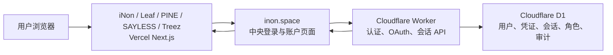

# iNon SSO 五项目接入与上线报告

日期：2026-07-26

## 结论

iNon、Leaf、PINE、SAYLESS、Treez 五个指定项目已经全部完成代码接入，统一消费公开包 `@inon-ai/inon-sso@0.1.0`，并通过同一套中央 OAuth 2.1/OIDC、项目会话和角色模型接入 `https://inon.space`。

五个项目的接入代码都已提交到各自 feature 分支、推送到 GitHub、合并并推送到默认主分支。五个项目均已更新 Vercel 生产部署，并在内置浏览器中完成真实的中央跳转、无感授权、项目回调、项目会话和业务页面验收。

2026-07-26 的现场验收还修复了三类只会在真实浏览器和生产链路中暴露的问题：

1. Vercel 到 Cloudflare Worker 的客户端 IP、请求体和 Turnstile 校验传播；
2. Vercel 代理对 Worker 压缩响应的二次压缩；
3. OAuth authorize JSON 跳转包未转换为浏览器 `303` 跳转，以及项目顶层 `/api` 导航被内置浏览器拦截。

五个项目现在统一提供普通页面形式的 `/sso/start`、`/sso/refresh`、`/sso/end`，再在服务端交给同一 SDK 处理。登录按钮使用原生链接，受保护页面和客户端操作复用同一套路径，不再各自拼接 `/api/auth/inon/*`。

## 统一架构

- 唯一公开身份品牌与 Origin：`iNon`、`https://inon.space`。
- 中央页面：`/sso/login`、`/sso/account`。
- 中央后端：Cloudflare Worker。
- 中央数据库：Cloudflare D1 `inon-sso`。
- 项目部署：Vercel。
- 项目只保存加密 HttpOnly 项目会话 Cookie，不保存中央密码或复制用户表。
- 五个项目各有独立 Client ID、Client Secret 和项目会话加密密钥。
- 五个第一方 Client 强制 PKCE、跳过授权确认页、只接受固定回调。

## 登录与账户能力

- 只允许邮箱验证码创建账号；
- 支持邮箱验证码登录；
- 支持邮箱密码登录；
- 支持用户名密码登录；
- 支持 GitHub 登录和安全账号绑定；
- 已验证用户可选设置用户名和密码，不强制首次登录立即设置；
- 单个账号只绑定一个邮箱；
- 用户名全局唯一，支持中文、英文、数字、下划线和短横线；
- 用户名每 30 天最多修改一次；
- 不提供用户自行删除账号；
- 会话为 30 天滑动有效期和 90 天绝对上限；
- 邮件统一由 Resend 以 `iNon <account@inon.space>` 发出。

## 权限模型

- 普通成员：首次进入任一项目时自动、幂等创建；
- 项目管理员：按项目独立分配；
- 全局超级管理员：全系统唯一一人；
- 项目管理员不能任命或撤销其他项目管理员；
- 全局超级管理员可以任命或撤销项目管理员；
- Leaf Team Member 是 Leaf 内部的特殊成员关系，可由 Leaf 项目管理员维护，不等同于项目管理员。

## 五项目状态

| 项目 | 默认分支提交 | 生产状态 | 回调地址 | 说明 |
| --- | --- | --- | --- | --- |
| iNon | `87075f5` | READY | `https://inon.space/api/auth/inon/callback` | 中央站点与 relying party 同域部署 |
| SAYLESS | `efc9102` | READY | `https://sayless.inon.space/api/auth/inon/callback` | 已移除旧登录入口 |
| Leaf | `e3c0280` | READY | `https://leaf.inon.space/api/auth/inon/callback` | 保留 Leaf Team Member 项目关系 |
| PINE | `bbf6a76` | READY | `https://pine.inon.space/api/auth/inon/callback` | 旧业务数据库退役，不在本工程重建 |
| Treez | `2015f05` | READY | `https://treez.inon.space/api/auth/inon/callback` | 在现有 Next.js 迁移基线上完成接入 |

## PINE 特殊处理

PINE 的旧 Supabase 项目已经废弃。本轮没有重建题库、进度、投稿或审核等业务数据库，也没有为其创建替代业务数据库。

- 所有 `supabase.auth.*` 运行时调用已移除；
- 身份、项目角色与页面保护统一使用 iNon SSO；
- `/api/db/query` 固定返回 `410 PINE_BUSINESS_DATABASE_RETIRED`；
- 未来若恢复 PINE 业务数据层，应作为独立工程在 Cloudflare 上重新设计。

## 生产验收证据

中央服务与 iNon：

- 最终部署：`dpl_Cq4gx2S4fBfZXthKGwTiVBbHBGJP`；
- 邮箱验证码由 Resend 真实发送，并通过 Gmail 收件箱获取后完成首次注册；
- Turnstile 在生产域名真实通过；
- 账户中心可读取当前账号、会话、项目管理员和唯一全局超级管理员状态；
- 密码已通过账户中心真实设置，页面显示密码能力已启用；
- 退出中央会话后使用邮箱和密码成功重新登录同一个账号；
- 从 `/login?next=/admin` 发起项目登录后自动返回 `/admin/assets`；
- 后台显示当前账号，证明 iNon 项目会话和超级管理员的项目管理员映射生效。

Leaf：

- 最终部署：`dpl_A16BCsB6EnK5sEmUAC6eYvEEijhz`；
- 浏览器直接进入 `/mine`；
- 未建立 Leaf 项目会话时自动进入中央 SSO；
- 中央会话存在时无需再次输入凭证，自动返回 `/mine`；
- 页面确认账号已成为 Leaf 普通成员；
- 账号未被错误映射为 Team Member，符合 Team Member 独立业务关系规则；
- 全局超级管理员可见 Leaf 管理入口。

PINE：

- 最终部署：`dpl_FPw44USY1A3MzDcoiBfkauHawuA9`；
- 从生产首页点击真实顶栏“登录”链接；
- 自动完成 `PINE → inon.space → PINE`；
- 回到首页后顶栏显示当前账号；
- 侧栏出现“贡献题目”和“审核管理”，证明项目会话和管理员映射生效；
- 业务数据库仍保持退役，本工程没有重建或扩大 PINE 业务数据范围。

SAYLESS：

- 最终部署：`dpl_84byqrz996RHquqwrAk5dny7LSjm`；
- 从 `sayless.inon.space` 首页点击真实“登录”链接；
- 自动完成中央 SSO 并返回 `/app`；
- SAYLESS 真实业务数据成功加载，证明项目会话已映射到现有业务用户，而非仅完成页面跳转；
- 登录后可访问求职总览、批次、投递和面试数据。

Treez：

- 最终部署：`dpl_4XoFd5QycWp4mcRp9gHbcN2HAgZL`；
- 从 Treez 原生登录链接进入中央 authorize；
- 中央 authorize 正确返回 `303`，自动回到 Treez callback 和 `/basic/home`；
- 顶栏显示当前账号；
- 受保护的 `/user/me` 成功打开；
- 页面显示 Treez 项目管理员身份，证明全局超级管理员映射生效。

GitHub：

- iNon 账户中心的 GitHub 绑定 Turnstile 已真实通过；
- 浏览器成功进入 GitHub 官方 `Authorize iNon` 页面；
- GitHub 页面确认请求 `read:user` 与 `user:email`，回调指向 `https://inon.space/api/sso/github/callback`；
- GitHub 授权回调成功返回 iNon 账户中心，账户状态显示 `Linked`；
- 退出中央会话后点击“使用 GitHub 继续”，无需邮箱验证码或密码即可重新进入同一个账号；
- 重新登录后邮箱、唯一全局超级管理员、密码状态和 GitHub 绑定状态保持一致，没有创建重复账号。

## 当前生产身份状态

- 生产账号已通过邮箱验证码创建并验证；
- 密码登录能力已启用；
- 全局超级管理员已通过幂等 bootstrap 绑定，且当前仍为唯一一人；
- 五个项目均已建立成员关系；
- 全局超级管理员在五个项目中均解析为项目管理员；
- Leaf Team Member 仍为独立项目关系，未被超级管理员身份自动占用；
- 中央会话为 30 天滑动有效、90 天绝对上限；
- 当前设备可在账户中心查看。

## 已完成的所有者操作

- 阿里云 DNS 已添加 `pine` 和 `treez` 记录；
- 所有者邮箱首次验证码登录已完成；
- 唯一全局超级管理员绑定已完成；
- 账户密码设置已完成；
- 邮箱密码登录已完成；
- GitHub 绑定与 GitHub 登录已完成；
- 五项目浏览器端到端登录已完成。

## 尚需完成

1. 设置一个符合规则的用户名后，验证用户名密码登录；用户名设置不是首次登录必填项。
2. 以非超级管理员测试项目管理员无法任命其他管理员，以及 Leaf 管理员可维护 Team Member。
3. 轮换在搭建沟通中暴露过的：

- GitHub OAuth App Client Secret；
- Resend API Key。

轮换后更新 Cloudflare Worker Secret，并再次验证 GitHub 回调与邮件验证码。密钥不得写入 Git 仓库或本报告。

## 非 SSO 后续问题

Leaf 现有 Supabase 表 `public.classmates`、`public.recordings`、`public.teachers` 的 RLS 未启用，浏览器 anon key 仍可能直接修改数据。该问题不阻塞中央 SSO 上线，但应作为独立的数据授权整改任务处理，不能把项目管理员页面保护误认为数据库行级安全。

## 交付物

- 中央 SSO：`iNon/sso/`；
- 公共 SDK：`@inon-ai/inon-sso@0.1.0`；
- Cloudflare D1：`inon-sso`；
- Cloudflare Worker：`inon-sso`；
- 五项目生产接入文档：各项目 `.agents/docs/260726/`；
- 本报告：`.agents/docs/260726/inon-sso-five-project-rollout.md`。
