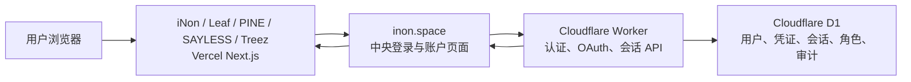

# iNon SSO 五项目接入与上线报告

日期：2026-07-26

## 结论

iNon、Leaf、PINE、SAYLESS、Treez 五个指定项目已经全部完成代码接入，统一消费公开包 `@inon-ai/inon-sso@0.1.0`，并通过同一套中央 OAuth 2.1/OIDC、项目会话和角色模型接入 `https://inon.space`。

五个项目的接入代码都已提交到各自 feature 分支、推送到 GitHub、合并并推送到默认主分支。PINE 与 Treez 已创建或更新 Vercel 生产项目、写入独立项目凭证并完成受保护部署地址的生产探针。

## 统一架构



- 唯一公开身份品牌与 Origin：`iNon`、`https://inon.space`。
- 中央页面：`/sso/login`、`/sso/account`。
- 中央后端：Cloudflare Worker。
- 中央数据库：Cloudflare D1 `inon-sso`。
- 项目部署：Vercel。
- 项目只保存加密 HttpOnly 项目会话 Cookie，不保存中央密码或复制用户表。
- 五个项目各有独立 Client ID、Client Secret 和项目会话加密密钥。
- 五个第一方 Client 强制 PKCE、跳过授权确认页、只接受固定回调。

## 登录与账户能力

- 只允许邮箱验证码创建账号；
- 支持邮箱验证码登录；
- 支持邮箱密码登录；
- 支持用户名密码登录；
- 支持 GitHub 登录和安全账号绑定；
- 已验证用户可选设置用户名和密码，不强制首次登录立即设置；
- 单个账号只绑定一个邮箱；
- 用户名全局唯一，支持中文、英文、数字、下划线和短横线；
- 用户名每 30 天最多修改一次；
- 不提供用户自行删除账号；
- 会话为 30 天滑动有效期和 90 天绝对上限；
- 邮件统一由 Resend 以 `iNon <account@inon.space>` 发出。

## 权限模型

- 普通成员：首次进入任一项目时自动、幂等创建；
- 项目管理员：按项目独立分配；
- 全局超级管理员：全系统唯一一人；
- 项目管理员不能任命或撤销其他项目管理员；
- 全局超级管理员可以任命或撤销项目管理员；
- Leaf Team Member 是 Leaf 内部的特殊成员关系，可由 Leaf 项目管理员维护，不等同于项目管理员。

## 五项目状态

| 项目 | 默认分支提交 | 生产状态 | 回调地址 | 说明 |
| --- | --- | --- | --- | --- |
| iNon | `8173d69` | READY | `https://inon.space/api/auth/inon/callback` | 中央站点与 relying party 同域部署 |
| SAYLESS | `65f50e7` | READY | `https://sayless.inon.space/api/auth/inon/callback` | 已移除旧登录入口 |
| Leaf | `d0740c1` | READY | `https://leaf.inon.space/api/auth/inon/callback` | 保留 Leaf Team Member 项目关系 |
| PINE | `ffa819b` | READY | `https://pine.inon.space/api/auth/inon/callback` | 旧业务数据库退役，不在本工程重建 |
| Treez | `becbf39` | READY | `https://treez.inon.space/api/auth/inon/callback` | 在现有 Next.js 迁移基线上完成接入 |

## PINE 特殊处理

PINE 的旧 Supabase 项目已经废弃。本轮没有重建题库、进度、投稿或审核等业务数据库，也没有为其创建替代业务数据库。

- 所有 `supabase.auth.*` 运行时调用已移除；
- 身份、项目角色与页面保护统一使用 iNon SSO；
- `/api/db/query` 固定返回 `410 PINE_BUSINESS_DATABASE_RETIRED`；
- 未来若恢复 PINE 业务数据层，应作为独立工程在 Cloudflare 上重新设计。

## 生产验收证据

中央服务：

- `/api/sso/health`：200；
- OIDC Discovery：200，Issuer 与端点为规范地址；
- JWKS：200，包含可用签名密钥；
- `/sso/login`：200；
- 项目登录发起：303；
- 直接访问非规范 Worker 状态写入口：421。

PINE：

- 最终部署：`dpl_GakBP8GDFqJdX43b6cxAHqxXXaFT`；
- `/api/auth/me` 未登录返回空用户；
- 登录发起 303，回调精确指向 `pine.inon.space`；
- `/profile` 未登录返回 307；
- `/api/db/query` 返回 410；
- 管理员页面在页面边界向中央服务重新确认当前角色。

Treez：

- Vercel 项目：`yingyingdontkill/treez`；
- 最终部署：`dpl_4mZGD2CKBASXVnEUCLC92iUQfZgM`；
- `/api/health`：200；
- `/api/auth/me`：200 且 `Cache-Control: private, no-store`；
- 登录发起 303，回调精确指向 `treez.inon.space`；
- `/user/me` 未登录返回 307。

## 当前 D1 状态

上线后对生产 D1 进行了只读查询：

```text
user_count = 0
super_admin_count = 0
membership_count = 0
```

这表示生产结构、五个 OAuth Client 和权限模型已经就绪，但所有者尚未完成第一次验证登录，因此全局超级管理员还不能绑定。

## 需要所有者手动完成

### 1. 阿里云 DNS

在 `inon.space` 的阿里云 DNS 中添加：

| 记录类型 | 主机记录 | 记录值 |
| --- | --- | --- |
| A | `pine` | `76.76.21.21` |
| A | `treez` | `76.76.21.21` |

Vercel 项目已经绑定两个域名；这里只缺权威 DNS 记录。

### 2. 第一次所有者登录

DNS 生效后，在 `https://inon.space/sso/login` 使用所有者邮箱完成一次邮箱验证码注册或登录。账号必须处于 `emailVerified = 1` 和 `active` 状态。

### 3. 唯一超级管理员绑定

所有者验证完成后，使用内部 bootstrap 脚本按邮箱绑定唯一 `super_admin`。该操作幂等，若角色已经绑定到另一账号会失败关闭。

### 4. 浏览器端到端验收

使用同一中央账号依次验证：

1. 邮箱验证码注册；
2. 邮箱验证码登录；
3. 设置用户名与密码；
4. 邮箱密码登录；
5. 用户名密码登录；
6. GitHub 登录与绑定；
7. 登录后进入其余四个项目无需重新输入凭证；
8. 五个项目首次进入都只创建普通成员；
9. 项目退出、刷新、30 天滑动和 90 天绝对上限；
10. 超级管理员授予和撤销项目管理员；
11. 项目管理员无法管理其他管理员；
12. Leaf 管理员可以维护 Team Member。

### 5. 生产密钥轮换

端到端验收完成后，轮换在搭建沟通中暴露过的：

- GitHub OAuth App Client Secret；
- Resend API Key。

轮换后更新 Cloudflare Worker Secret，并再次验证 GitHub 回调与邮件验证码。

## 非 SSO 后续问题

Leaf 现有 Supabase 表 `public.classmates`、`public.recordings`、`public.teachers` 的 RLS 未启用，浏览器 anon key 仍可能直接修改数据。该问题不阻塞中央 SSO 上线，但应作为独立的数据授权整改任务处理，不能把项目管理员页面保护误认为数据库行级安全。

## 交付物

- 中央 SSO：`iNon/sso/`；
- 公共 SDK：`@inon-ai/inon-sso@0.1.0`；
- Cloudflare D1：`inon-sso`；
- Cloudflare Worker：`inon-sso`；
- 五项目生产接入文档：各项目 `.agents/docs/260726/`；
- 本报告：`.agents/docs/260726/inon-sso-five-project-rollout.md`。
