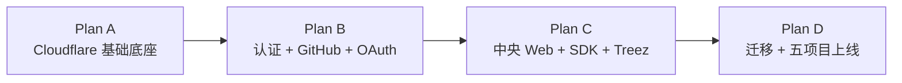

# iNon SSO Program Implementation Plan

> **For agentic workers:** REQUIRED SUB-SKILL: Use superpowers:subagent-driven-development (recommended) or superpowers:executing-plans to implement this plan task-by-task. Steps use checkbox (`- [ ]`) syntax for tracking.

**Goal:** 在 Cloudflare 上建设 iNon 中央身份服务，并让 iNon、Leaf、PINE、SAYLESS、Treez 通过同一套 Next.js SDK 接入真正的 SSO。

**Architecture:** `inon.space` 上的 Next.js 页面负责中央用户界面，Vercel 将 `/sso/api/*` 反向代理到 Cloudflare Worker；Worker 使用 Better Auth、OAuth 2.1/OIDC 和 D1 维护唯一身份与会话。五个项目只依赖版本化共享 SDK，不复制协议、Cookie 和权限代码。

**Tech Stack:** TypeScript 6.0.3、Next.js 16.2.10、React 19.2.7、Cloudflare Workers、D1、Better Auth 1.6.25、OAuth Provider 1.6.25、Hono 4.12.32、Vitest 4.1.10、Workers Vitest Pool 0.18.8、Resend 6.18.0、Zod 3.23.8。

## Global Constraints

- 中央代码必须位于 `iNon/sso/`。
- 设计、计划、报告和验收文档必须位于 `iNon/.agents/docs/260726/`。
- 唯一生产身份 Origin 为 `https://inon.space`。
- 身份、凭证、会话、项目角色、OAuth Token 和审计的真实来源必须是 Cloudflare D1。
- iNon 主站及五个项目继续部署在 Vercel。
- 只接入 iNon、Leaf、PINE、SAYLESS、Treez。
- 只允许邮箱验证码注册；支持邮箱验证码、邮箱密码、用户名密码和 GitHub 登录。
- 一个账号只允许一个邮箱；不允许用户自行删除账号。
- 中央 Session 为 30 天滑动有效期和 90 天绝对上限。
- 五个第一方 OAuth Client 不展示 Consent 页面。
- Secret、OTP、密码和完整 Token 不得进入 Git 或日志。
- 任何跨项目重复逻辑必须进入共享 Contracts、SDK 或 UI 包。
- 所有身份依赖锁定精确版本并提交 Lockfile。
- 每个实施任务遵循 TDD，并在完成后形成独立可审查提交。

---

## 1. 子计划边界

本工程按可独立运行、可独立测试的交付物拆为四份实施计划。

### Plan A：Cloudflare 基础底座

文档：`inon-sso-foundation-implementation-plan.md`

交付：

- `iNon/sso/` 独立 pnpm Workspace。
- Worker、D1 和 Workers Vitest 测试环境。
- 共享领域契约。
- 项目、成员、全局角色、审计等基础 Schema。
- D1 Repository 和并发安全约束。
- Canonical Origin、错误格式和健康检查。

进入下一阶段的门槛：

- `pnpm typecheck`、`pnpm test`、`pnpm build` 全部通过。
- 本地 D1 迁移可重复执行。
- 五个项目 Seed 可验证。
- Worker 内部 Origin 不会成为产品 Canonical Origin。

### Plan B：认证、GitHub 与 OAuth/OIDC

文档：在 Plan A 验收后创建 `inon-sso-auth-implementation-plan.md`。

交付：

- Better Auth D1 Schema。
- 邮箱 OTP 注册和登录。
- 账户内设置密码。
- 邮箱密码和用户名密码登录。
- GitHub 登录、显式绑定和安全自动合并。
- 30/90 Session。
- OAuth 2.1/OIDC Provider。
- 五个可信 Client。
- Resend、Turnstile、限流、审计和安全通知。

进入下一阶段的门槛：

- Auth、Session、GitHub、PKCE、Token 轮换和竞态测试通过。
- OpenID Configuration 与 JWKS 可验证。
- 无用户名密码注册入口。
- 不存在明文 OTP、GitHub Token 和 Refresh Token 泄漏。

### Plan C：中央 Web 与共享 Next.js SDK

文档：在 Plan B 验收后创建 `inon-sso-web-sdk-implementation-plan.md`。

交付：

- `inon.space/sso` 登录、注册、账户、安全、设备和管理页面。
- Vercel External Rewrite。
- `@inon/sso-next`。
- 统一用户菜单和登录入口。
- Treez 参考应用。

进入下一阶段的门槛：

- Vercel Rewrite 对请求体、Metadata、Host 和 `Set-Cookie` 的探针通过。
- Treez 完成登录、无感 SSO、刷新、登出和成员初始化。
- 项目中不存在复制的 OAuth Callback 和 Claims 解析逻辑。

### Plan D：迁移、五项目接入与上线

文档：在 Treez 参考实现验收后创建 `inon-sso-rollout-implementation-plan.md`。

交付：

- 旧身份只读导出和去重。
- iNon、Leaf、PINE、SAYLESS 并行接入。
- Leaf Team Member 档案绑定。
- 五项目统一验收。
- Resend/GitHub 生产配置。
- D1 备份、迁移、部署和回滚手册。
- 正式切换与旧鉴权删除。

完成门槛：

- 五个生产项目均只使用 iNon SSO。
- 用户在一个项目登录后进入其余项目无需重新输入凭证。
- 旧密码和旧 Session 全部失效。
- 全部迁移用户通过邮箱 OTP 或合规 GitHub 身份重新确认。
- 权限、会话、安全、迁移和回滚验收全部有可复现证据。

## 2. 执行顺序



每份子计划完成后：

1. 运行该计划列出的全部验证。
2. 将验证结果写入 `.agents/docs/260726/`。
3. 使用 `git-commit` Skill 审查并提交该阶段。
4. 再创建和执行下一份子计划。

## 3. 跨计划接口

Plan A 固定以下公共接口，后续计划只能兼容扩展，不能在项目中重新定义：

```ts
export const projectKeys = ["inon", "leaf", "pine", "sayless", "treez"] as const;
export type ProjectKey = (typeof projectKeys)[number];

export type ProjectRole = "member" | "admin";
export type GlobalRole = "super_admin";

export interface InonIdentityClaims {
  sub: string;
  email: string;
  emailVerified: boolean;
  username: string | null;
  project: ProjectKey;
  projectRole: ProjectRole;
}
```

Plan B 提供：

```ts
export interface AuthRuntime {
  fetch(request: Request): Promise<Response>;
}

export interface ProjectAuthorization {
  ensureMembership(userId: string, project: ProjectKey): Promise<ProjectRole>;
  getRole(userId: string, project: ProjectKey): Promise<ProjectRole | null>;
}
```

Plan C 提供：

```ts
export interface InonSession {
  user: {
    id: string;
    email: string;
    username: string | null;
  };
  project: ProjectKey;
  role: ProjectRole;
  expiresAt: string;
}

export function getInonSession(): Promise<InonSession | null>;
export function requireInonUser(): Promise<InonSession>;
export function requireProjectAdmin(): Promise<InonSession>;
```

Plan D 中的五个项目只消费上述 SDK 接口，不直接访问中央 D1，不自行验证 Better Auth 内部 Cookie，不复制 OAuth Token 交换实现。

## 4. 计划级风险门

以下任一情况发生时停止生产推进，但继续在本地修复和验证：

- Better Auth 生成的 D1 Schema 与锁定版本不一致。
- 90 天绝对 Session 上限无法在服务端强制执行。
- GitHub 无法可靠取得 verified 邮箱。
- Vercel Rewrite 改写或丢失关键 Cookie/Metadata。
- D1 并发测试发现 Authorization Code 或 Refresh Token 可重复消费。
- 项目管理员可以提升其他管理员。
- 任一 Secret 或完整 Token 出现在 Git Diff、测试快照或日志。

## 5. 阶段性提交策略

建议阶段提交：

1. `chore(sso): scaffold cloudflare workspace`
2. `feat(sso): add shared identity contracts`
3. `feat(sso): add d1 authorization schema`
4. `feat(sso): add cloudflare worker foundation`
5. `feat(sso): add central authentication flows`
6. `feat(sso): add github identity linking`
7. `feat(sso): add oauth provider and sessions`
8. `feat(sso): add central account experience`
9. `feat(sso): publish next integration sdk`
10. `feat(treez): integrate inon sso`
11. 按项目分别提交其余接入。
12. `chore(auth): complete inon sso migration`

提交前始终使用 `git-commit` Skill，并保证提交只包含当前阶段相关文件。
