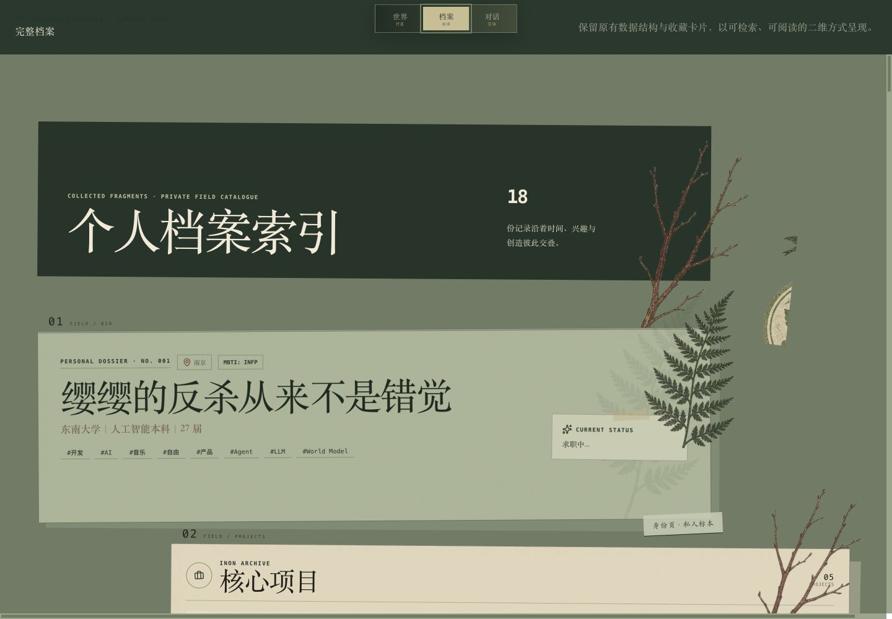
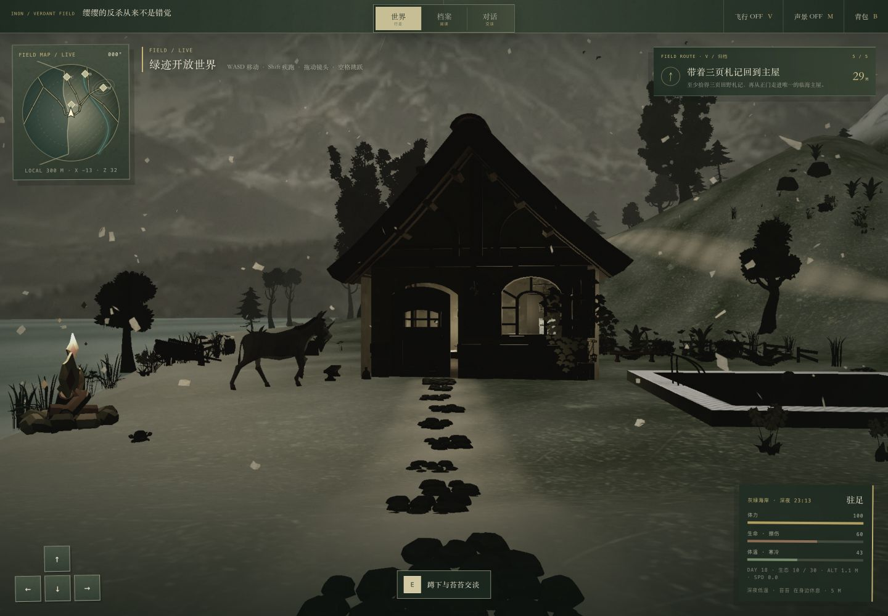
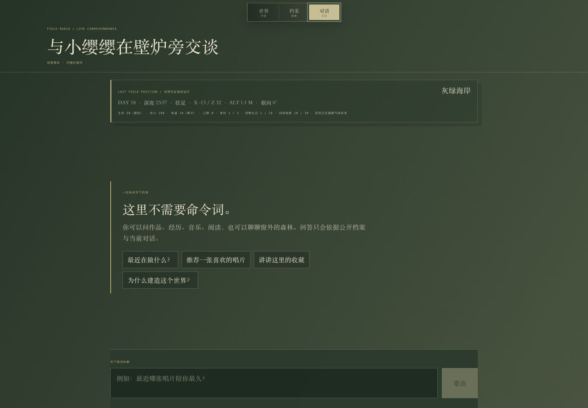
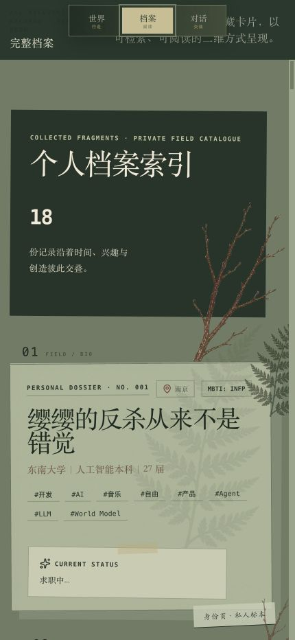
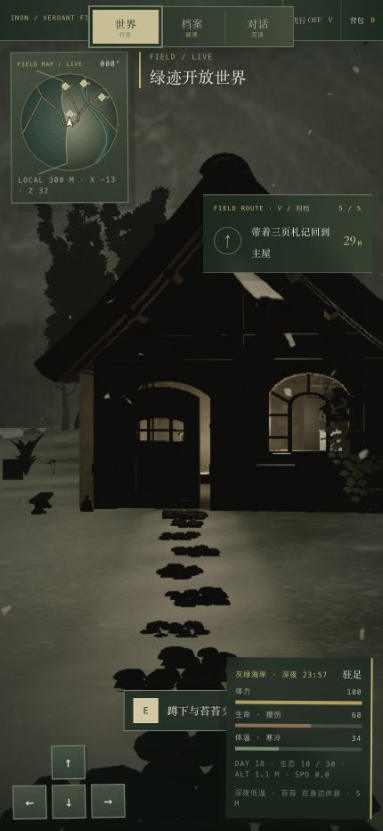
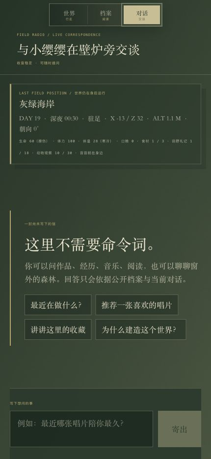

# iNon — 把个人资料变成一座可以探索的数字世界

> iNon 是一个开源、可自托管的个人数字花园与个人操作系统。它用同一份结构化数据驱动内容管理、Block 档案、3D 开放世界、AI 分身与公开个人网站。

[简体中文](docs/README_ZH_CN.md) · [繁體中文](docs/README_ZH_TW.md) · [日本語](docs/README_JA.md)

## iNon 是什么

传统个人网站通常从模板开始：选择主题、填写固定字段，然后得到一张静态名片。iNon 从“人本身的数据”开始——经历、项目、收藏、作品、关系、习惯和观点都以结构化内容保存，再由不同界面重新组织和呈现。

iNon 目前包含三个彼此连接的产品表面：

- **公开空间 `/:slug`**：任何人都可以阅读的个人档案；访客还可以切换到 3D 世界或 AI 对话，进行第一人称探索、田野路线、生态观察、采集和休整。
- **个人控制台 `/i/:slug`**：账号所有者管理内容、收藏库、公开档案布局、留言、访问统计和账号信息的工作台。
- **资产后台 `/admin`**：仅项目管理员可访问的公共对象存储资产库。

它们不是三套互相复制的数据：公开世界和控制台共享同一份个人档案、Block 注册表与布局配置。

## 产品预览

### 桌面端



| 绿迹开放世界 | 场景感知 AI 对话 |
| --- | --- |
|  |  |

### 移动端

| 个人档案 | 绿迹开放世界 | AI 对话 |
| --- | --- | --- |
|  |  |  |

> 截图于 2026 年 8 月 4 日从当前本地应用实机截取，分别对应“档案 / 世界 / 对话”三种公开体验模式。

## 核心能力

### 1. 档案优先、按需加载的公开个人空间

公开页默认先显示可检索、可阅读的二维 Block 档案，避免让 3D 资源阻塞首屏。浏览器空闲且未开启省流量模式时，页面会预取 React Three Fiber 世界；访客也可以随时在“档案 / 世界 / 对话”三种模式之间切换。

进入世界模式后，访客可以：

- 以第一人称在海岸、河谷、主屋、潮汐湾和雪线等区域移动；
- 通过小地图和田野路线前往不同地点；
- 收集由个人资料生成的田野札记，并在主屋查看展品与记录；
- 观察世界中的物种并完善生态观察册；
- 管理体力、体温、生命、口粮和采集材料；
- 在营火或床铺休整，让世界时间继续流动；
- 在“档案”模式中阅读结构化的 Non Blocks；
- 与个人 AI 分身或伙伴“苔苔”对话。

探索进度、札记、世界时钟、生态观察等轻量状态保存在浏览器本地；个人档案内容来自服务端数据库。

### 2. 面向所有者的个人控制台

`/i/:slug` 只允许该 username 或 slug 的所有者访问，包含七个工作区：

| 工作区 | 路由 | 用途 |
| --- | --- | --- |
| 控制台 | `/i/:slug/home` | 查看个人摘要、常用网站和项目入口 |
| 内容管理 | `/i/:slug/content` | 编辑个人信息、经历、教育、工作、项目、创作、联系信息等 |
| 我的库 | `/i/:slug/library` | 管理音乐、影视、书籍和游戏等收藏数据 |
| 公开网站 | `/i/:slug/website` | 调整 Block 顺序、显隐、单双栏宽度和主题，800 ms 防抖自动保存 |
| 留言管理 | `/i/:slug/messages` | 查看访客留言并控制其公开可见性 |
| 数据统计 | `/i/:slug/analytics` | 查看访问量、来源、路径、设备、浏览器和国家/地区统计 |
| 账号管理 | `/i/:slug/account` | 管理 username、多个 slug 与账号资料 |

### 3. Non Block 组件系统

Non 是 iNon 的内容展示原子。同一套 Block 数据和组件用于控制台画板与公开世界中的档案模式；Block 标题和图标统一由 `lib/blocks/registry.ts` 提供，避免导航、编辑器和公开界面各自维护一份配置。

当前渲染器支持 22 类 Block：

| Block type | 展示内容 |
| --- | --- |
| `bio` | 姓名、简介、状态、城市、MBTI 与关键词 |
| `bookmarks` | 从开发工具数据生成的常用网站入口 |
| `ai_clone` | 打开个人 AI 分身对话 |
| `app_launcher` | App 与工具快捷入口 |
| `projects` | 项目、角色、状态、技术栈与链接 |
| `music` | 非嘻哈音乐人、专辑与歌曲收藏 |
| `hiphop` | 独立筛选的嘻哈音乐收藏 |
| `movies` | 影视作品和创作者收藏 |
| `books` | 书籍和作者收藏 |
| `games` | 游戏作品和创作者收藏 |
| `timeline` | 城市、日期与人生经历时间线 |
| `friend_links` | 由平台账号组织的友情链接 |
| `contact` | 联系方式与访客联系入口 |
| `education` | 学校、专业和导师信息 |
| `work` | 当前工作、工作经历与偏好 |
| `products` | 喜爱/推荐产品、硬件和品牌 |
| `creation` | 视频、文章、演讲、座右铭和引语 |
| `events` | 演出、演讲和线下活动 |
| `tags` | 关键词、价值观、习惯、偏好和技能标签 |
| `skills` | 技术栈与专业能力 |
| `dev_tools` | 日常开发工具 |
| `messages` | 已公开的访客留言 |

`thoughts` 已保留在类型和注册表中，但当前没有进入默认布局或 `BlockRenderer`，仍属于待接通能力。默认布局启用 21 个 Block；`games` 可以由布局数据显式加入。

### 4. 场景感知 AI 分身

`POST /api/assistant` 会把个人档案转换为 Markdown，并与经过校验的世界快照一起组成系统上下文。世界快照包括位置、时间、行动、体力、体温、生命、口粮、已拾札记和已观察物种，因此 AI 可以回答“我现在在哪里”“是否该休息”“观察到哪些动物”等场景问题。

当前实现通过 OpenRouter 的 OpenAI-compatible Chat Completions 接口调用 `openrouter/free`，并以纯文本流返回内容。环境变量仍沿用历史名称 `OPENAI_API_KEY`，实际应填入可访问 OpenRouter 接口的密钥。

### 5. 多用户、多个公开地址与严格权限

- 用户名全局唯一；一个用户可以拥有多个全局唯一 slug。
- slug 可为空，因此 `/` 可以作为默认公开页，`/i` 会解析并跳转到当前用户的主控制台。
- 未登录访客可以读取公开页并提交留言。
- 已登录用户只能读写自己的 `/i/:slug` 和账号 API。
- 项目管理员才能访问 `/admin` 和 `/api/admin/*`。
- 身份与项目角色来自中央 iNon SSO；Supabase 中的 profile 通过 `inon_user_id` 与中央身份绑定。

## 系统架构

```text
                                 ┌────────────────────────────┐
                                 │  Central iNon SSO          │
                                 │  Cloudflare Worker + D1    │
                                 │  identity / session / role │
                                 └─────────────┬──────────────┘
                                               │ @inon-ai/inon-sso
                                               ▼
┌──────────────────────────┐      ┌────────────────────────────┐
│ Supabase                 │      │ Next.js 16 application    │
│ Postgres + Storage       │◀────▶│ App Router + Server APIs  │
│ profile / content /      │      │ Cache Components enabled  │
│ layout / message / stats │      └─────────────┬──────────────┘
└──────────────────────────┘                    │
                                  ┌─────────────┴─────────────┐
                                  ▼                           ▼
                       ┌─────────────────────┐     ┌─────────────────────┐
                       │ Owner Console      │     │ Public Experience   │
                       │ CRUD + Block canvas│     │ archive + 3D world  │
                       │ analytics + account│     │ AI + visitor message│
                       └─────────────────────┘     └─────────────────────┘
```

### 数据读取与缓存

公开页优先调用 Supabase RPC `read_public_profile_page`，一次聚合 profile、内容源和布局配置；RPC 不可用时退回现有分表读取逻辑。Next.js Cache Components 对公开结果使用统一 cache tag：

- stale：5 分钟；
- revalidate：1 小时；
- expire：24 小时；
- 内容或布局写入后通过 `revalidatePath` 刷新受影响的公开页和控制台路径。

控制台页面使用动态渲染，避免把用户私有数据混入公共缓存。

## 路由与 API

### 页面路由

| 路由 | 访问者 | 说明 |
| --- | --- | --- |
| `/` | 公开 | 空 slug 对应的默认个人空间 |
| `/:slug` | 公开 | 指定用户的公开档案、3D 世界与 AI 对话 |
| `/login` | 公开 | 登录入口，随后交给中央 SSO |
| `/sso/*` | 公开/会话 | 中央身份页面、回调、刷新与同域反向代理 |
| `/i` | 已登录用户 | 解析当前用户并跳转到主控制台 |
| `/i/:slug/*` | 所有者 | 个人控制台的七个工作区 |
| `/admin` | 项目管理员 | 管理后台入口 |
| `/admin/assets` | 项目管理员 | Supabase Storage 资产库 |

### 主要 API

| API | 方法 | 权限 | 用途 |
| --- | --- | --- | --- |
| `/api/assistant` | `POST` | 公开 | 流式 AI 对话 |
| `/api/messages` | `POST` | 公开 | 提交访客留言 |
| `/api/account/content/:section` | `PUT` | 已登录用户 | 更新个人内容分区 |
| `/api/account/layout` | `GET/PUT` | 已登录用户 | 读取或保存 Block 布局与主题 |
| `/api/account/settings` | `GET/PUT` | 已登录用户 | 读取或更新 username 与 slugs |
| `/api/account/messages` | `GET/PATCH` | 已登录用户 | 获取留言和切换可见性 |
| `/api/admin/assets` | `GET/PATCH` | 项目管理员 | 查询和编辑资产元数据 |
| `/api/admin/assets/upload` | `POST` | 项目管理员 | 上传文件到 `public-assets` bucket |
| `/api/admin/assets/:id` | `DELETE` | 项目管理员 | 删除资产记录与对象 |
| `/api/auth/inon/:action` | `GET` | 公开/会话 | iNon 项目 OAuth/会话处理器 |
| `/api/sso/*` | 多方法 | 公开/会话 | 将同域 SSO 请求转发给中央后端 |

`proxy.ts` 在请求进入页面或 API 前统一保护 `/i/*`、`/admin/*`、`/api/account/*` 和 `/api/admin/*`，并处理登录、session refresh、所有权校验与管理员角色校验。

## 技术栈

| 层级 | 技术 |
| --- | --- |
| Web | Next.js 16 App Router、React 19、React Server Components、Cache Components、Turbopack |
| 语言 | TypeScript 6 |
| 样式与动效 | Tailwind CSS 4、Framer Motion、GSAP、Lucide React、next-themes |
| 3D 世界 | Three.js、React Three Fiber、Drei、Rapier |
| 状态与数据 | Zustand、TanStack Query、nuqs |
| 表单与校验 | React Hook Form、Zod |
| 业务数据 | Supabase Postgres、RPC、Row Level Security、Storage |
| 身份平台 | `@inon-ai/inon-sso`、Cloudflare Workers、D1、Better Auth、Hono |
| AI | OpenRouter OpenAI-compatible API、流式响应、档案 Markdown 上下文 |
| 分析 | 自建聚合访问统计 + Vercel Analytics + 加盐 IP 哈希 |

## 仓库结构

```text
iNon/
├── app/
│   ├── [slug]/                 # 公开个人世界
│   ├── i/[slug]/               # 所有者控制台
│   ├── admin/                  # 管理员资产库
│   ├── login/                  # 登录入口
│   ├── sso/                    # 中央 SSO 页面与会话流程
│   └── api/                    # assistant / messages / account / admin / SSO API
├── components/
│   ├── blocks/                 # Non Block、画板、服务端档案与公开模式切换
│   ├── world/                  # 3D 开放世界、HUD、生态与生存系统
│   ├── scenes/                 # 收藏与经历的独立 3D 场景
│   ├── dashboard/              # 控制台导航和工作区
│   ├── editor/                 # Schema-driven 内容编辑器
│   ├── account/                # slug、账号与统计界面
│   ├── admin/                  # 资产后台 UI
│   ├── nav/                    # 公共导航、AI 面板与弹窗
│   └── layout/                 # 公共和控制台壳层
├── hooks/                      # 布局、AI、上传和开放世界状态 hooks
├── lib/
│   ├── auth/                   # 用户、所有权和管理员访问控制
│   ├── blocks/registry.ts      # Block 标题与图标单一事实源
│   ├── content/                # 数据读取、映射、缓存与 mutations
│   ├── analytics/              # 访问记录与聚合查询
│   ├── sso/                    # 项目 SSO client、session 与反向代理
│   └── supabase/               # 服务端与 service-role clients
├── types/                      # 内容、数据库与布局类型
├── supabase/
│   ├── config.toml             # 本地 Supabase 配置
│   └── migrations/             # 内容、slug、资产、统计、RPC migrations
├── sso/                        # 中央 SSO 独立 pnpm workspace
├── public/                     # 静态资源与 3D 模型
├── scripts/                    # 本地维护、迁移、校验和资产脚本（本仓库忽略）
├── proxy.ts                    # Next.js 请求级权限保护
└── next.config.ts              # Cache Components 等 Next.js 配置
```

## 本地开发

### 前置条件

- Node.js `>= 20.19.0`；
- pnpm（SSO workspace 固定为 pnpm `9.12.0`）；
- 一个可用的 Supabase 项目，或本地 Supabase CLI 环境；
- 已配置的中央 iNon SSO 后端和 `inon` OAuth client；
- 如需 AI 对话，一个可访问 OpenRouter 的 API key。

### 1. 安装依赖

```bash
pnpm install --frozen-lockfile
```

如果还要开发仓库内的中央 SSO workspace：

```bash
pnpm --dir sso install --frozen-lockfile
```

### 2. 配置环境变量

复制示例文件：

```bash
cp .env.example .env.local
```

| 变量 | 作用 | 暴露范围 |
| --- | --- | --- |
| `OPENAI_API_KEY` | 当前用于 OpenRouter Chat Completions | 仅服务端 |
| `NEXT_PUBLIC_SUPABASE_URL` | Supabase 项目 URL | 浏览器与服务端 |
| `NEXT_PUBLIC_SUPABASE_PUBLISHABLE_KEY` | Supabase publishable key | 浏览器与服务端 |
| `SUPABASE_SECRET_KEY` | 服务端管理数据、Storage 和 RPC | 仅服务端 |
| `ANALYTICS_IP_SALT` | 访问统计 IP 哈希盐，建议至少 32 bytes hex | 仅服务端 |
| `INON_SSO_BACKEND_URL` | 中央 SSO Worker 地址 | 仅服务端 |
| `INON_SSO_PROXY_SECRET` | Web 应用到 SSO Worker 的反向代理密钥 | 仅服务端 |
| `INON_SSO_PUBLIC_ORIGIN` | 当前应用公开 origin；本地开发设为 `http://localhost:3000` | 仅服务端 |
| `NEXT_PUBLIC_INON_TURNSTILE_SITE_KEY` | 登录界面的 Cloudflare Turnstile site key | 浏览器 |
| `INON_SSO_CLIENT_ID` | `inon` 项目的 OAuth client id | 仅服务端 |
| `INON_SSO_CLIENT_SECRET` | `inon` 项目的 OAuth client secret | 仅服务端 |
| `INON_SSO_SESSION_SECRET` | 项目会话签名密钥 | 仅服务端 |

不要提交 `.env.local`、`.env.development.local` 或任何真实密钥。开发环境使用 HTTP 时，`INON_SSO_PUBLIC_ORIGIN` 必须明确使用 `http://localhost:3000`，使 session cookie 不带 Secure 标志；对应回调地址也必须已在中央 SSO client 中注册。

### 3. 准备数据库

将项目链接到目标 Supabase 后应用 migrations：

```bash
pnpm db:push
```

迁移会创建个人档案、内容、收藏库、slugs、布局、留言、资产、访问事件、每日聚合统计和公开页聚合 RPC。生产环境应使用独立的 `SUPABASE_SECRET_KEY`，并保留现有 RLS 策略。

### 4. 启动应用

```bash
pnpm dev
```

默认访问地址是 [http://localhost:3000](http://localhost:3000)。生产构建：

```bash
pnpm build
pnpm start
```

## 常用命令

| 命令 | 说明 |
| --- | --- |
| `pnpm dev` | 使用 Turbopack 启动开发服务器 |
| `pnpm build` | 创建生产构建 |
| `pnpm start` | 启动生产服务器 |
| `pnpm exec tsc --noEmit` | 执行 TypeScript 类型检查 |
| `pnpm db:push` | 推送 Supabase migrations |
| `pnpm db:validate` | 校验 README 内容数据与数据库字段完整性 |
| `pnpm db:upload-assets` | 将本地资产上传到 Supabase Storage |
| `pnpm --dir sso typecheck` | 检查中央 SSO workspace 类型 |
| `pnpm --dir sso test` | 运行中央 SSO workspace 测试 |
| `pnpm --dir sso build` | 构建 SSO packages，并对 Worker 做部署 dry-run |

> `scripts/` 被 `.gitignore` 忽略，其中维护脚本属于本地工作流；克隆公开仓库时，不应假设所有本机脚本都会随 Git 提供。

## 开发约定

### 新增一个 Non Block

1. 在 `types/layout.ts` 增加新的 `BlockType`。
2. 在 `lib/blocks/registry.ts` 注册唯一的标题和图标。
3. 在 `components/blocks/` 实现展示组件。
4. 在 `BlockRenderer.tsx` 添加数据映射和渲染分支。
5. 如需默认展示，在 `lib/content/default-layout.ts` 添加结构配置。
6. 如果内容可编辑，同时补充类型、数据库 migration、mapper、mutation 和编辑器 schema。
7. 在控制台和公开世界的档案模式中分别验证显隐、顺序、宽度和响应式效果。

不要在 Block、侧栏或默认布局中重复硬编码标题与图标；注册表是这类展示元数据的单一事实源。

### 数据与权限

- 公开读取走聚合 RPC，并保留兼容旧数据结构的 fallback。
- 用户写入必须以中央 SSO user id 限定 profile，不接受客户端传入任意 profile id。
- 管理操作必须通过项目管理员 session 校验。
- `SUPABASE_SECRET_KEY`、SSO client secret、proxy secret 和 session secret 只能在服务端读取。
- 新增公开缓存数据时，mutation 必须同步触发 cache tag/path 失效。
- 新增采集型分析字段时，避免保存原始 IP；当前实现使用服务端 salt 哈希。

## 当前边界与路线图

已完成：

- [x] 多用户 profile、username 与多 slug；
- [x] 中央 iNon SSO、项目 session 与管理员角色；
- [x] 内容、收藏库、布局、留言和账号管理；
- [x] 22 类可渲染 Non Blocks 与统一注册表；
- [x] Block 顺序、显隐、宽度、主题与自动保存；
- [x] Supabase Storage 资产后台；
- [x] 自建访问事件与每日聚合统计；
- [x] 档案优先的公开页、按需加载的 3D 世界、田野路线、生存状态、生态观察与本地进度；
- [x] 个人档案 + 世界状态驱动的流式 AI 对话；
- [x] 聚合公开页 RPC 与 Next.js 公共缓存失效机制。

仍在演进：

- [ ] 将 `thoughts` 正式接入 BlockRenderer 与默认布局；
- [ ] 为 AI 增加明确的多模型路由、成本控制和访客上下文记忆；
- [ ] 继续完善 Work、Education、Products 等 3D 场景；
- [ ] 完善资产发布流程和更细粒度的留言审核；
- [ ] 让控制台画板与公开世界档案模式拥有更直接的可视化对应关系；
- [ ] 同步维护各语言 README 与最新公开世界截图。

当前已知的开发工具问题：根目录的 `pnpm lint` 仍指向 Next.js 16 已移除的 `next lint`；现有 ESLint compatibility 配置也会在 ESLint 9 下触发循环结构错误。在修正 `eslint.config.mjs` 与 package script 前，请以 `pnpm exec tsc --noEmit` 和生产构建作为基础静态校验，不要把 `pnpm lint` 的失败误判为业务代码错误。

## 部署说明

Web 应用可以部署到支持 Next.js 16 Node.js runtime 的平台。一次完整部署至少需要：

1. 已应用全部 `supabase/migrations/` 的 Supabase 项目；
2. 可公开访问的中央 SSO Worker 与 D1 数据库；
3. 为生产 origin 注册的 `inon` OAuth client 和精确回调地址；
4. 平台中配置好的全部服务端和 `NEXT_PUBLIC_*` 环境变量；
5. Supabase `public-assets` bucket 及对应访问策略；
6. 构建后对公开页、登录回调、所有者控制台、管理员资产库和 AI 流式响应进行真实浏览器验证。

仓库中的 `sso/` 是独立 pnpm workspace。它的 Cloudflare Worker、D1 migrations、共享 contracts 和 Next.js SDK 有自己的构建与部署周期，详见 [`sso/README.md`](sso/README.md)。

## License

iNon 使用 [GNU Affero General Public License v3.0](LICENSE)。如果你修改本项目并通过网络向用户提供服务，需要按照 AGPL-3.0 提供对应的完整源代码。

## 项目历程与作者

项目从最早的页面原型逐步演进为 Block-based 个人操作系统和 3D 数字世界，过程记录见 [Project Evolution](docs/PROJECT_EVOLUTION.md)。

由 [YingYingDontKill（何锦诚 / Jackson He）](https://github.com/JacksonHe04) 创建和维护。欢迎提交 issue、反馈、fork 或 star。
